# Simons Observatory Map-Based Noise Simulation Pipeline

This repository contains a pipeline for generating realistic map-based noise simulations for the Simons Observatory (SO) Small Aperture Telescope (SAT).

## Overview

The noise simulation pipeline generates correlated noise maps in HEALPix format that include:
- White noise component based on the specified noise level in μK-arcmin
- Atmospheric 1/f noise component characterized by a knee multipole and spectral slope
- Spatial inhomogeneity from the SO SAT scanning pattern (relative hits map)

The output maps are in Stokes I, Q, U (temperature and polarization) with units of μK_CMB.

## Pipeline Components

### `generate_noise.py`
Core module containing the `SimonsObservatoryNoise` class that generates noise realizations. Key features:
- Configurable via YAML parameter files or Python dictionaries
- Reproducible random number generation using `numpy.random.SeedSequence`
- Supports multiple frequency channels with independent random streams

### `run_generate_noise.py`
Driver script that generates multiple noise realizations for all channels specified in a YAML configuration file.

### `validate_noise.py`
Validation script that compares the measured power spectra of generated noise maps against the theoretical noise model.

## Noise Model

### Theoretical Power Spectrum

The noise power spectrum follows the model:

$$N_\ell = N_{\rm white} \left(1 + \left(\frac{\ell}{\ell_{\rm knee}}\right)^{\alpha_{\rm knee}}\right)$$

where:
- $N_{\rm white} = \left(\sigma \cdot \frac{\pi}{180 \times 60}\right)^2$ is the white noise level in μK²·sr
- $\sigma$ is the noise level in μK-arcmin
- $\ell_{\rm knee}$ is the knee multipole where atmospheric noise equals white noise
- $\alpha_{\rm knee}$ is the spectral slope of the atmospheric component (negative)

For temperature maps, an additional factor of $1/\sqrt{2}$ is applied to account for the convention.

### Generating Homogeneous Noise Maps

The pipeline first generates **homogeneous noise maps** with the correct power spectrum in harmonic space:

1. **Generate unit-variance Gaussian alms**: Random complex spherical harmonic coefficients $a_{\ell m}$ are drawn from a Gaussian distribution with unit variance. The $m=0$ modes are real, while $m \neq 0$ modes have equal real and imaginary parts scaled by $1/\sqrt{2}$.

2. **Apply the noise power spectrum**: The alms are scaled by $\sqrt{N_\ell}$ to imprint the desired power spectrum:
   $$a_{\ell m}^{\rm noise} = a_{\ell m}^{\rm Gaussian} \cdot \sqrt{N_\ell}$$

3. **Transform to pixel space**: The scaled alms are transformed to HEALPix maps using `healpy.alm2map`.

At this stage, the noise maps have uniform noise properties across the sky (homogeneous).

### Adding Spatial Inhomogeneity with Relative Hits Maps

Real observations have spatially varying noise levels due to the telescope scanning strategy. Regions observed more frequently have lower noise. This is captured by the **relative hits map** $h(\hat{n})$, which represents the relative integration time at each pixel.

The inhomogeneous noise map is constructed by scaling the homogeneous map:

$$n_{\rm inhom}(\hat{n}) = \frac{n_{\rm hom}(\hat{n})}{\sqrt{h(\hat{n})}}$$

This ensures that:
- Pixels with more hits ($h > 1$) have **lower** noise variance
- Pixels with fewer hits ($h < 1$) have **higher** noise variance
- The noise variance at pixel $\hat{n}$ scales as $\sigma^2(\hat{n}) \propto 1/h(\hat{n})$

The relative hits map is normalized such that the mean noise level matches the specified μK-arcmin value.

### Recovering Homogeneous Maps for Analysis

For power spectrum analysis, it is often useful to **homogenize** the noise maps by reversing the hits weighting:

$$n_{\rm hom}(\hat{n}) = n_{\rm inhom}(\hat{n}) \cdot \sqrt{h(\hat{n})}$$

This recovers a map with uniform noise properties, which simplifies the interpretation of the measured power spectrum.

## Instrument Parameters

### Baseline Pessimistic Configuration

| Channel | Frequency (GHz) | Beam FWHM (arcmin) | Noise (μK-arcmin) | ℓ_knee | α_knee |
|---------|-----------------|--------------------|--------------------|--------|--------|
| LF027   | 27              | 91                 | 16.0               | 30     | -2.4   |
| LF039   | 39              | 63                 | 10.0               | 30     | -2.4   |
| MF093   | 93              | 30                 | 1.7                | 50     | -2.5   |
| MF145   | 145             | 17                 | 2.1                | 50     | -3.0   |
| HF225   | 225             | 11                 | 5.9                | 70     | -3.0   |
| HF280   | 280             | 9                  | 15.0               | 100    | -3.0   |

## Usage

### Generating Noise Maps

1. Configure the parameters in `run_generate_noise.py`:
   - `NSIMS`: Number of noise realizations to generate
   - `YAML_FILE`: Path to the instrument parameter file
   - `BASE_OUTPUT_DIR`: Output directory

2. Run the generation script:
```bash
python run_generate_noise.py
```

Output files are named: `sobs_noise_{channel}_mc{sim_idx:03d}_nside{nside:04d}.fits`

### Validating Noise Maps

Run the validation script to compare measured spectra with theory:
```bash
python validate_noise.py
```

This produces:
- Mollweide projection plots of the noise maps (I, Q, U)
- Power spectrum comparison plots (TT, EE, BB)

## Validation Results

The validation script computes power spectra and compares against the theoretical noise model using two approaches:

### Power Spectrum Estimation Methods

#### 1. Hits-Weighted Pseudo-Cl (healpy.anafast)

For quick validation, we compute pseudo-$C_\ell$ using `healpy.anafast` with the relative hits map as weights:

$$\tilde{C}_\ell = \frac{1}{f_{\rm sky}} \cdot \text{anafast}(n \cdot h)$$

where $h$ is the relative hits map and $f_{\rm sky}$ is the effective sky fraction. This provides a fast estimate but does not account for mode coupling from the mask.

#### 2. Homogenized Spectrum with NaMaster

For a more rigorous validation, we use **NaMaster** (pymaster) to compute the power spectrum of the homogenized noise maps with proper mode-coupling correction:

1. **Homogenize the noise map**: Multiply by $\sqrt{h(\hat{n})}$ to obtain uniform noise
2. **Apply apodized mask**: Use a C2-apodized binary mask to reduce edge effects
3. **Compute coupling matrix**: NaMaster computes the mode-coupling matrix $M_{\ell\ell'}$ from the mask
4. **Decouple the pseudo-Cl**: The true power spectrum is recovered via:
   $$C_\ell = M_{\ell\ell'}^{-1} \tilde{C}_{\ell'}$$

The NaMaster approach properly accounts for:
- Mode coupling due to the partial sky coverage
- E/B leakage in polarization (when purification is enabled)
- Bandpower binning for reduced variance

### Noise Map Visualizations

#### LF027 (27 GHz)
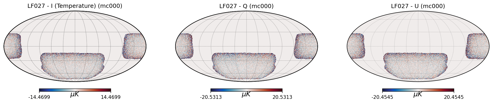

#### LF039 (39 GHz)
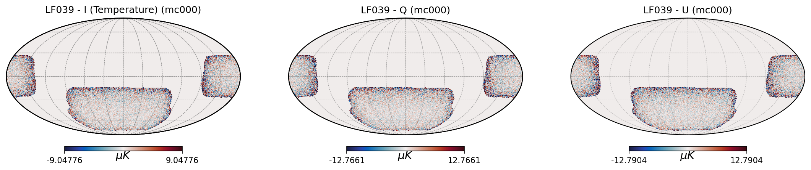

#### MF093 (93 GHz)
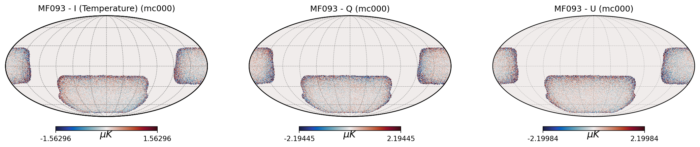

#### MF145 (145 GHz)
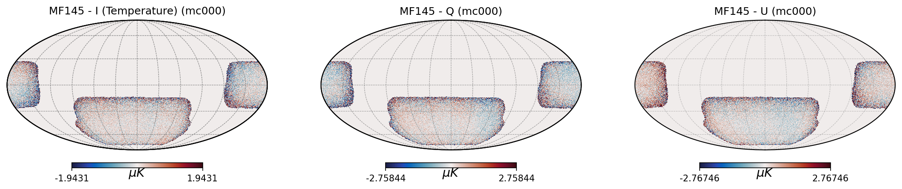

#### HF225 (225 GHz)
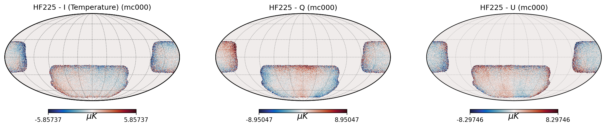

#### HF280 (280 GHz)
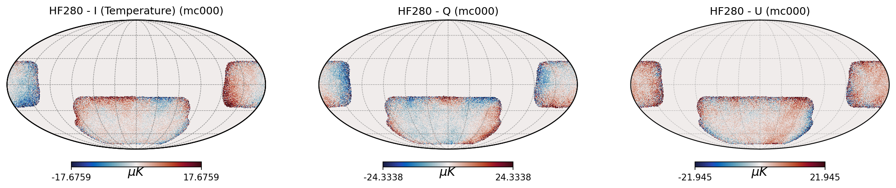

### Power Spectrum Validation

The following plots show the measured power spectra (averaged over multiple realizations) compared to the theoretical noise model. Two weighting schemes are shown:
- **Hits weighted**: Maps multiplied by the relative hits map
- **Homogenized**: Maps multiplied by √(relative hits) to produce uniform noise

#### LF027 (27 GHz)
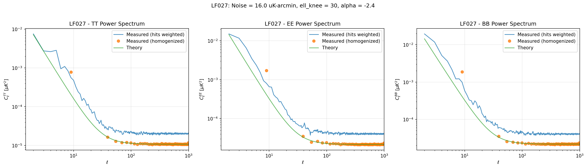

#### LF039 (39 GHz)
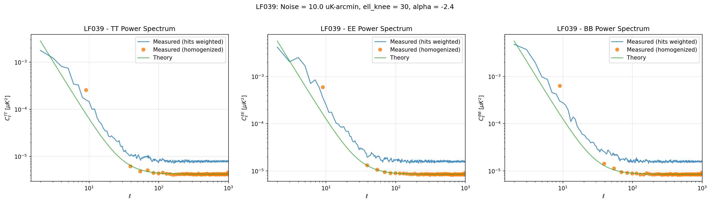

#### MF093 (93 GHz)


#### MF145 (145 GHz)
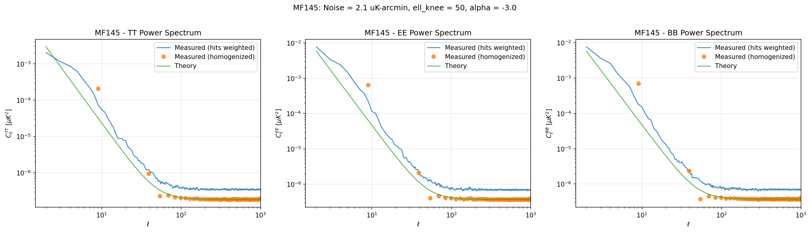

#### HF225 (225 GHz)
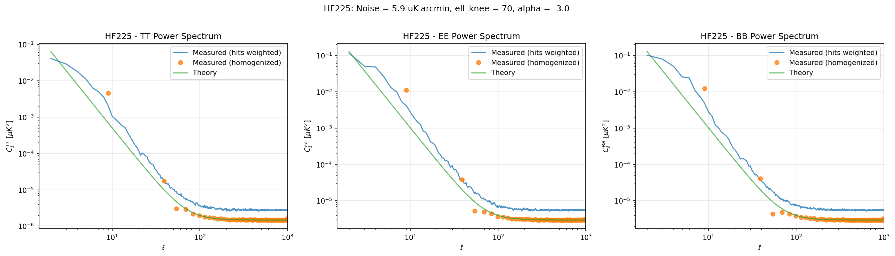

#### HF280 (280 GHz)
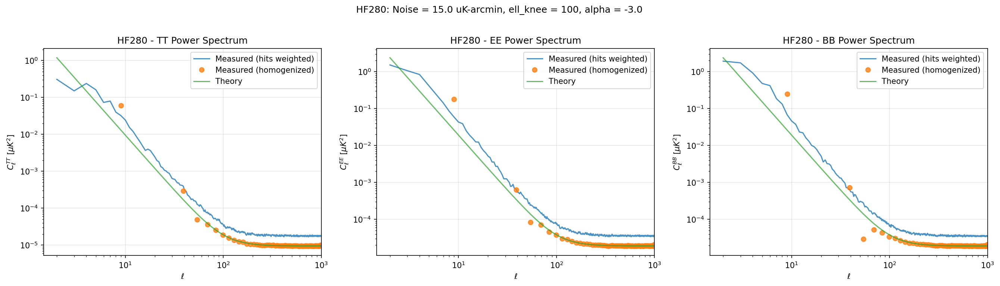

## File Structure

```
so_mapbased_noise/
├── code/
│   ├── generate_noise.py      # Core noise generation module
│   ├── run_generate_noise.py  # Driver script for batch generation
│   └── validate_noise.py      # Validation and plotting script
├── resources/
│   ├── instr_params_baseline_pessimistic.yaml  # Instrument parameters
│   ├── so_sat_relhits_C_nside512.fits          # Relative hits map
│   └── so_sat_full-binary_C_nside512.fits      # Binary footprint mask
├── output/
│   └── baseline_pessimistic/
│       ├── sobs_noise_*.fits   # Generated noise maps
│       └── validation/         # Validation plots
└── README.md
```

## Dependencies

- numpy
- healpy
- pyyaml
- matplotlib
- cmocean
- tqdm
- skytools
- pymaster (NaMaster) - for mode-coupling corrected power spectrum estimation

## Notes

- The noise maps are generated at NSIDE=512 by default
- Random seeds are managed via `numpy.random.SeedSequence` for reproducibility
- Each frequency channel has an independent random stream to avoid correlations
- The pipeline supports generating multiple splits for null-test applications
- Homogenized maps (multiplied by $\sqrt{h}$) recover the input noise spectrum when analyzed with NaMaster
