# SO LAT Map-Based Noise Simulation and Validation

This document describes the noise simulation pipeline for Simons Observatory Large Aperture Telescope (LAT) channels using the variance map method, and the validation procedures to verify the noise properties.

## Overview

The pipeline generates realistic noise realizations for SO LAT frequency channels that incorporate:
- **White noise** scaled by per-pixel observation depth (variance maps)
- **1/f atmospheric noise** with configurable knee frequency and spectral slope (distinct for Intensity vs Polarization)
- **Spatial inhomogeneity** from the scanning strategy

---

## 1. Noise Simulation Pipeline

### 1.1 Core Module: `generate_noise_lat.py`

The `SimonsObservatoryNoise` class implements noise generation using the **variance map method**:

```python
noise_gen = SimonsObservatoryNoise(
    channel_name,
    params=YAML_FILE,
    noise_method='variance_map',
    survey='wide',
    variance_map_dir=VARIANCE_MAP_DIR
)
noise_map = noise_gen.get_noise()  # Returns (3, npix) array for I, Q, U
```

#### Variance Map Method Algorithm

1. **Generate unit Gaussian noise** in pixel space for I, Q, U components (`noise_pix`).
2. **Transform to harmonic space**: `nlm = map2alm(noise_pix)`.
3. **Apply 1/f ell scaling**:
   - **Intensity (I)**: `nlm[0] *= sqrt(1 + (ell/ell_knee_i)^alpha_i)`
   - **Polarization (Q/U)**: `nlm[1,2] *= sqrt(1 + (ell/ell_knee_p)^alpha_p)`
4. **Transform back** to pixel space: `noise_pix = alm2map(nlm)`.
5. **Scale by variance map**: `noise_pix *= sqrt(variance_map)`.
   - The variance map contains white noise variance per pixel ($uK_{CMB}^2$).
6. **Rescale Temperature**: `noise_pix[0] /= sqrt(2)` 
   - Accounts for the fact that the initialized variance map represents polarization variance, and temperature noise is typically lower by $\sqrt{2}$.

#### Noise Model

The noise power spectrum for component $X \in \{I, P\}$ follows:

$$N_\ell^X = N_0 \left[1 + \left(\frac{\ell}{\ell_{\rm knee}^X}\right)^{\alpha^X}\right]$$

where:
- $N_0$ = white noise level (determined by NET and observation time via variance map)
- $\ell_{\rm knee}^X$ = knee multipole for component X
- $\alpha^X$ = spectral slope for component X

### 1.2 Batch Generation: `run_generate_noise_lat.py`

Generates Monte Carlo realizations for each channel specified in the YAML configuration:

```python
NSIMS = 10
YAML_FILE = '/pscratch/sd/s/shamikg/so_mapbased_noise/resources/instr_params_lat_channels.yaml'
NOISE_METHOD = 'variance_map'
SURVEY = 'wide'
```

---

## 2. Channel Specifications

### 2.1 Configuration

Source: `resources/instr_params_lat_channels.yaml`

| Channel | Frequency | Beam | ℓ_knee (I) | α (I) | ℓ_knee (P) | α (P) | nside | tel_yrs |
|---------|-----------|------|------------|-------|------------|-------|-------|---------|
| LF027 | 27 GHz | 7.4' | 500 | -3.5 | 700 | -1.4 | 2048 | 9.50 |
| LF039 | 39 GHz | 5.1' | 500 | -3.5 | 700 | -1.4 | 2048 | 9.50 |
| MF093 | 93 GHz | 2.2' | 2100 | -3.5 | 700 | -1.4 | 2048 | 82.00 |
| MF145 | 145 GHz | 1.4' | 3000 | -3.5 | 700 | -1.4 | 2048 | 82.00 |
| HF225 | 225 GHz | 1.0' | 3800 | -3.5 | 700 | -1.4 | 2048 | 41.00 |
| HF280 | 280 GHz | 0.9' | 3800 | -3.5 | 700 | -1.4 | 2048 | 41.00 |

### 2.2 Output Files

Output directory: `output/lat_channels/`

Filename syntax: `sobs_lat-noise_{channel}_mc{sim_idx:03d}_nside{nside:04d}.fits`

Each FITS file contains:
- 3-field HEALPix map (I, Q, U) in μK_CMB units
- Header with channel metadata

---

## 3. Validation

### 3.1 Validation Script: `validate_noise_lat.py`

(Note: This script should be created/verified to exist and perform similar checks as the SAT version)

Validation typically involves:
1. **Mollview Plots**: Visual inspection of noise morphology.
2. **Power Spectra**: Computing pseudo-Cls on a masked patch (e.g., wide survey footprint).
3. **Model Fitting**: Comparing measured spectra against the theoretical $N_\ell$ model defined by the YAML parameters.

### 3.2 Output Structure

Validation artifacts are saved to: `output/lat_channels/validation/`
- **mollview_{channel}_mc000.png**: Map visualizations.
- **bb_spectrum_{channel}.png**: B-mode power spectrum validation.
- **fit_results.txt**: Fitted white noise levels.

---

## 4. Validation Results

### 4.1 Noise Map Visualizations

Example mollview plots showing I, Q, U noise maps for the first realization (mc000).

| LF 27 GHz | LF 39 GHz |
|-----------|-----------|
| 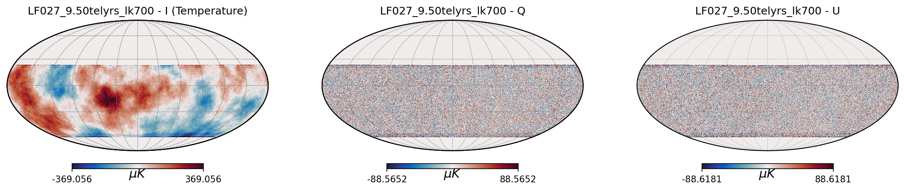 | 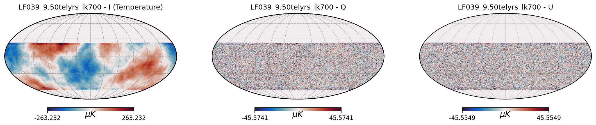 |

| MF 93 GHz | MF 145 GHz |
|-----------|------------|
| 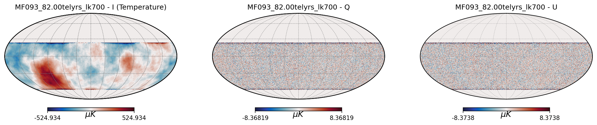 | 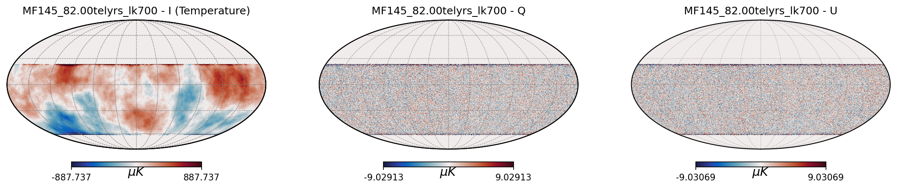 |

| HF 225 GHz | HF 280 GHz |
|------------|------------|
| 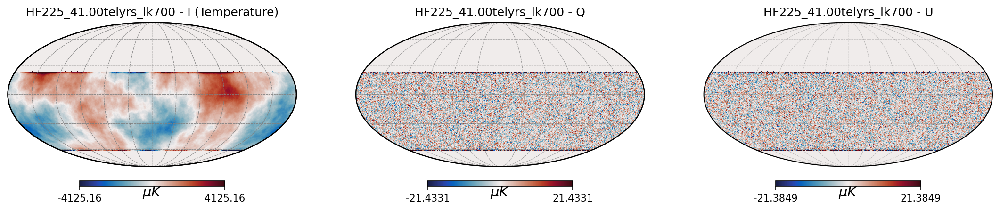 | 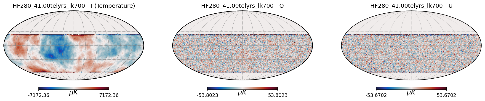 |

### 4.2 Power Spectra

Validation of the noise power spectra against the input model.

| LF 27 GHz | LF 39 GHz |
|-----------|-----------|
| 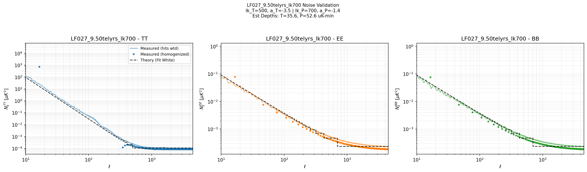 | 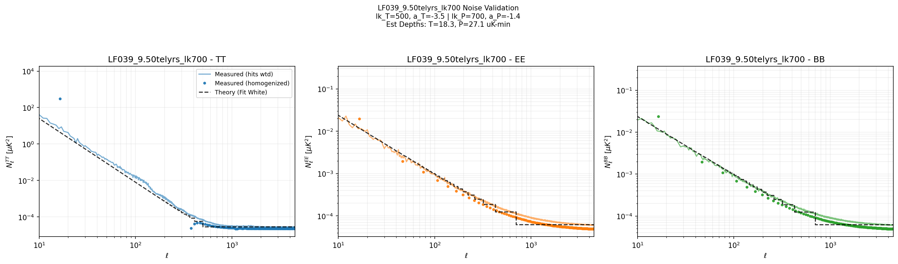 |

| MF 93 GHz | MF 145 GHz |
|-----------|------------|
| 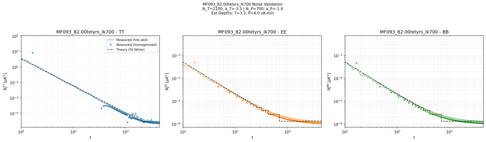 | 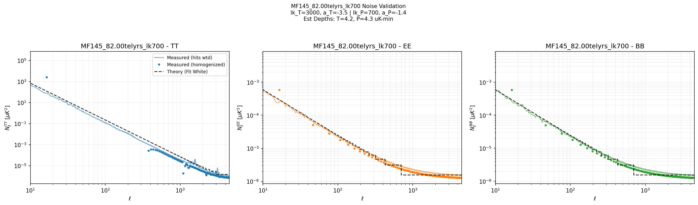 |

| HF 225 GHz | HF 280 GHz |
|------------|------------|
| 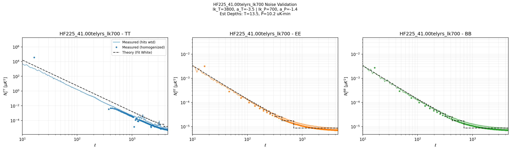 | 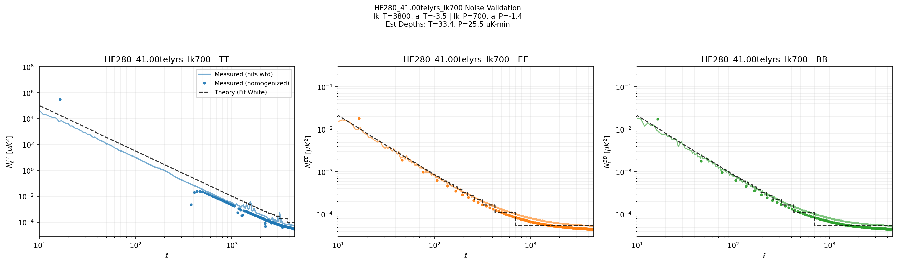 |
