# SO SAT Map-Based Noise Simulation and Validation

This document describes the noise simulation pipeline for Simons Observatory Small Aperture Telescope (SAT) channels using the variance map method, and the validation procedures to verify the noise properties.

## Overview

The pipeline generates realistic noise realizations for SO SAT frequency channels that incorporate:
- **White noise** scaled by per-pixel observation depth (variance maps)
- **1/f atmospheric noise** with configurable knee frequency and spectral slope
- **Spatial inhomogeneity** from the scanning strategy

---

## 1. Noise Simulation Pipeline

### 1.1 Core Module: `generate_noise.py`

The `SimonsObservatoryNoise` class implements noise generation using the **variance map method**:

```python
noise_gen = SimonsObservatoryNoise(
    channel,
    params=YAML_FILE,
    noise_method='variance_map',
    variance_map_dir=VARIANCE_MAP_DIR
)
noise_map = noise_gen.get_noise()  # Returns (3, npix) array for I, Q, U
```

#### Variance Map Method Algorithm

1. **Generate unit Gaussian noise** in pixel space for I, Q, U components
2. **Apply 1/f ell scaling** in harmonic space:
   - Transform to spherical harmonics: `nlm = map2alm(noise_pix)`
   - Apply scaling: `nlm *= sqrt(1 + (ell/ell_knee)^alpha)`
3. **Transform back** to pixel space
4. **Scale by variance map**: `noise *= sqrt(variance_map)`
5. **Rescale temperature**: `noise[0] /= sqrt(2)` to account for polarization noise being sqrt(2) higher

#### Noise Model

The noise power spectrum follows:

$$N_\ell = N_0 \left[1 + \left(\frac{\ell}{\ell_{\rm knee}}\right)^\alpha\right]$$

where:
- $N_0$ = white noise level (determined by NET and observation time via variance map)
- $\ell_{\rm knee}$ = knee multipole (atmospheric 1/f turnover)
- $\alpha$ = spectral slope (negative, typically -2.4 to -3.0)

### 1.2 Batch Generation: `run_generate_noise.py`

Generates 100 Monte Carlo realizations for each channel specified in the YAML configuration:

```python
NSIMS = 100
YAML_FILE = 'resources/instr_params_all_channels.yaml'
NOISE_METHOD = 'variance_map'
```

---

## 2. Channel Specifications

### 2.1 All Channels Configuration

Source: `resources/instr_params_all_channels.yaml`

| Channel | Frequency (GHz) | Beam FWHM (arcmin) | ℓ_knee | α | nside | tel_yrs |
|---------|-----------------|-------------------|--------|---|-------|---------|
| LF027_2.00telyrs_lk30 | 27 | 91 | 30 | -2.4 | 512 | 2.00 |
| LF027_8.50telyrs_lk30 | 27 | 91 | 30 | -2.4 | 512 | 8.50 |
| LF039_2.00telyrs_lk30 | 39 | 63 | 30 | -2.4 | 512 | 2.00 |
| LF039_8.50telyrs_lk30 | 39 | 63 | 30 | -2.4 | 512 | 8.50 |
| MF093_20.66telyrs_lk50 | 93 | 30 | 50 | -2.5 | 512 | 20.66 |
| MF093_36.66telyrs_lk50 | 93 | 30 | 50 | -2.5 | 512 | 36.66 |
| MF145_20.66telyrs_lk50 | 145 | 17 | 50 | -3.0 | 512 | 20.66 |
| MF145_36.66telyrs_lk50 | 145 | 17 | 50 | -3.0 | 512 | 36.66 |
| HF225_10.00telyrs_lk70 | 225 | 11 | 70 | -3.0 | 512 | 10.00 |
| HF225_17.00telyrs_lk70 | 225 | 11 | 70 | -3.0 | 512 | 17.00 |
| HF280_10.00telyrs_lk100 | 280 | 9 | 100 | -3.0 | 512 | 10.00 |
| HF280_17.00telyrs_lk100 | 280 | 9 | 100 | -3.0 | 512 | 17.00 |
| HF346_7.00telyrs_lk50 | 346 | 8 | 50 | -3.0 | 512 | 7.00 |
| HF346_14.00telyrs_lk50 | 346 | 8 | 50 | -3.0 | 512 | 14.00 |
| HF346_7.00telyrs_lk200 | 346 | 8 | 200 | -3.0 | 512 | 7.00 |
| HF346_14.00telyrs_lk200 | 346 | 8 | 200 | -3.0 | 512 | 14.00 |

### 2.2 Variance Maps

Located in: `resources/variance_maps/`

Filename syntax: `so_f{freq}_noise_var_{tel_yrs:.2f}tel-yrs.fits`

Examples:
- `so_f027_noise_var_2.00tel-yrs.fits`
- `so_f093_noise_var_20.66tel-yrs.fits`
- `so_f346_noise_var_7.00tel-yrs.fits`

### 2.3 Simulated Noise Maps

Output directory: `output/all_channels/`

Filename syntax: `sobs_noise_{channel}_mc{sim_idx:03d}_nside{nside:04d}.fits`

Examples:
- `sobs_noise_LF027_2.00telyrs_lk30_mc000_nside0512.fits`
- `sobs_noise_MF093_20.66telyrs_lk50_mc049_nside0512.fits`

Each FITS file contains:
- 3-field HEALPix map (I, Q, U) in μK_CMB units
- Header with channel metadata (frequency, ℓ_knee, α, tel_yrs, etc.)

---

## 3. Validation Method

Source: `code/validate_noise_all_channels.py`

### 3.1 Mollview Plots

For each channel, the zeroth realization (mc000) is visualized as I, Q, U mollview projections:
- Color scale: ±2σ (computed from pixels where `relhits_south > 0`)
- Colormap: `cmocean.balance` (diverging)

### 3.2 Power Spectrum Computation

Four BB power spectrum estimates are computed for each channel, averaged over 100 realizations:

#### Masking Schemes

1. **Relhits-weighted**: Uses south patch relative hits map as weights
   - Accounts for inhomogeneous depth
   - `weighted_map = noise_map × weight_south`

2. **Homogenized**: Rescales noise to uniform depth before masking
   - `homo_map = noise_map × sqrt(weight_south)`
   - Then apply apodized binary mask for power spectrum

The **homogenization** idea: multiplying by `sqrt(relhits)` converts the spatially-varying noise to approximately uniform noise level across the patch, making the power spectrum interpretation simpler. Note: we are using the relative hits from MF093. This is not identical to UHF hit maps. This slight difference means using the MF093 relative hits would not homogenize the UHF/EHF maps.

#### Spectrum Estimators

1. **Anafast**: Simple pseudo-Cℓ with fsky correction
   - Fast but biased at low-ℓ due to mode coupling

2. **NaMaster**: Mode-decoupled power spectrum
   - Computes coupling matrix from mask geometry
   - Returns unbiased bandpower estimates
   - Linear binning with Δℓ = 15

### 3.3 Noise Model Fitting

The noise model $N_\ell = N_0[1 + (\ell/\ell_{\rm knee})^\alpha]$ is evaluated with:

1. **N₀ fitted** from high-ℓ (500 < ℓ < 1000) where noise is white
   - Simple mean of decoupled BB spectrum in this range
   
2. **ℓ_knee and α from config file** (not fitted)
   - Used for visual comparison of model vs. data

---

## 4. Validation Results

### 4.1 Noise Map Visualizations

Example mollview plots showing I, Q, U noise maps:

| LF 27 GHz (2.00 tel-yrs) | LF 27 GHz (8.50 tel-yrs) |
|--------------------------|--------------------------|
|  | 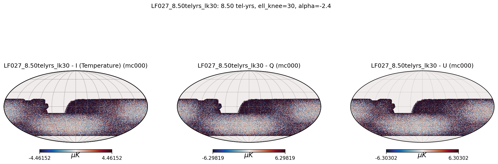 |

| MF 93 GHz (20.66 tel-yrs) | MF 145 GHz (20.66 tel-yrs) |
|---------------------------|----------------------------|
| 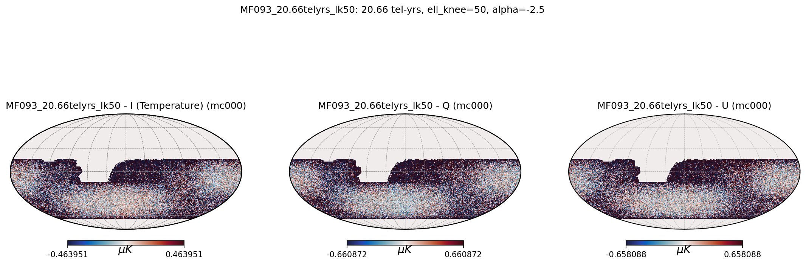 | 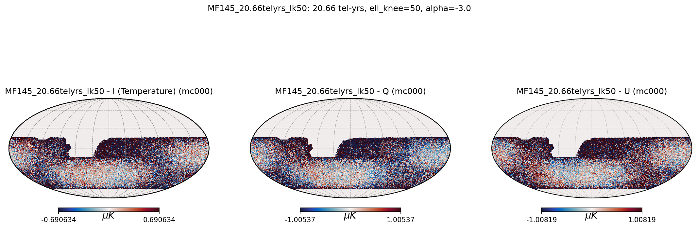 |

| HF 225 GHz (10.00 tel-yrs) | HF 280 GHz (10.00 tel-yrs) |
|----------------------------|----------------------------|
| 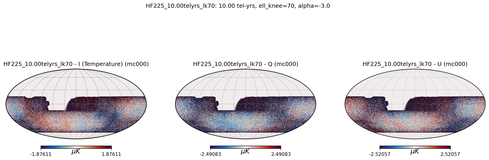 | 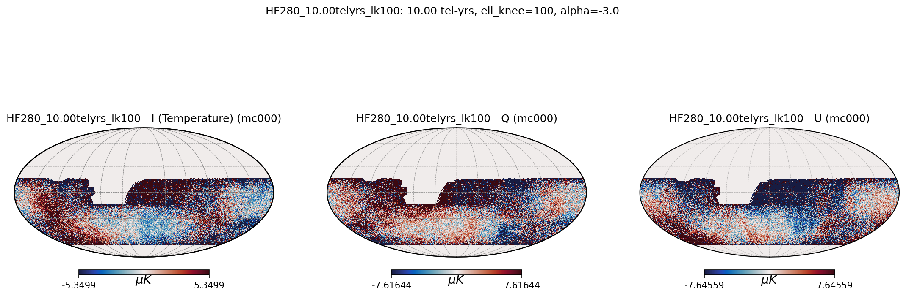 |

| HF 346 GHz (7.00 tel-yrs, ℓ_knee=50) | HF 346 GHz (7.00 tel-yrs, ℓ_knee=200) |
|--------------------------------------|---------------------------------------|
| 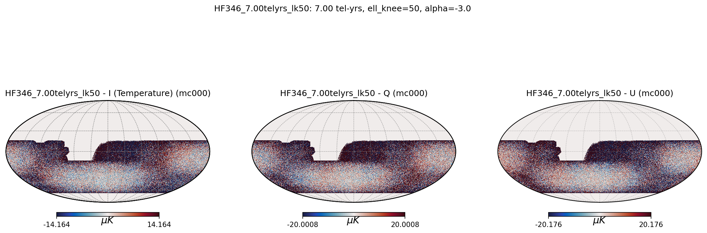 | 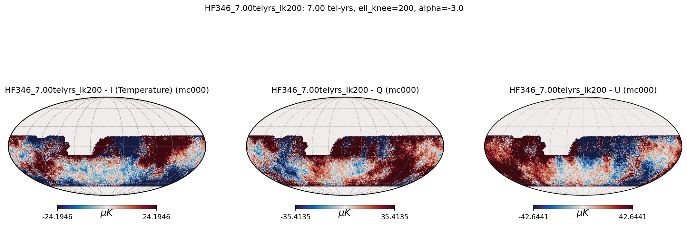 |

### 4.2 BB Power Spectra

Example power spectrum plots comparing measured spectra with noise model:

| LF 27 GHz | LF 39 GHz |
|-----------|-----------|
| 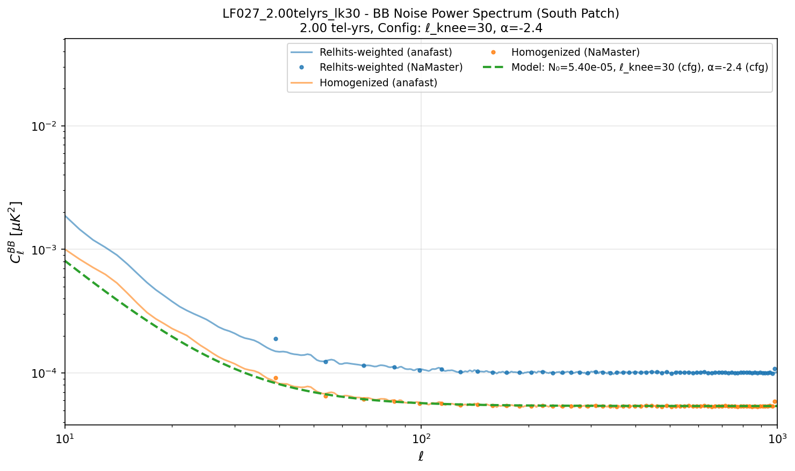 | 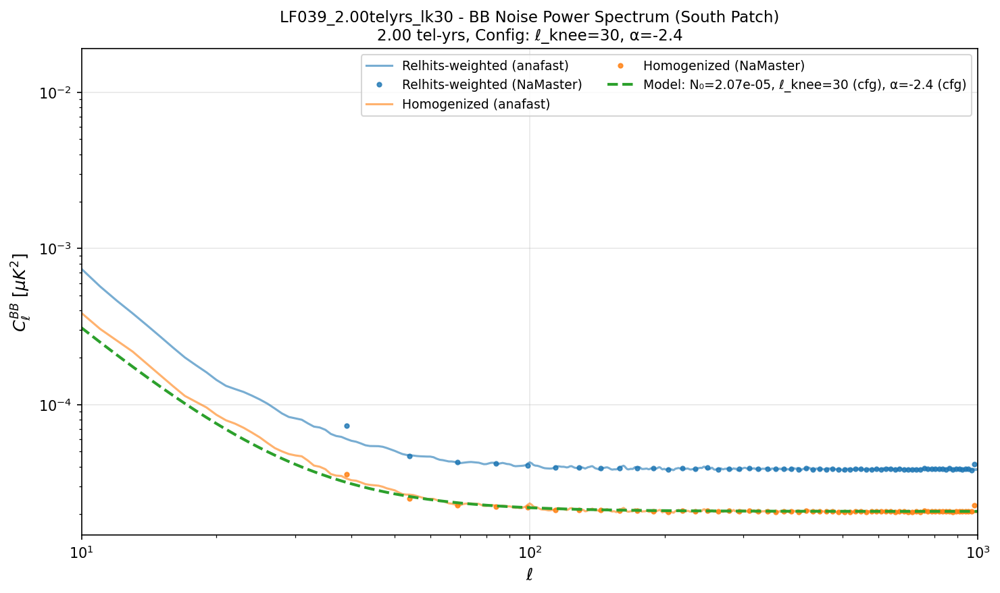 |

| MF 93 GHz | MF 145 GHz |
|-----------|------------|
| 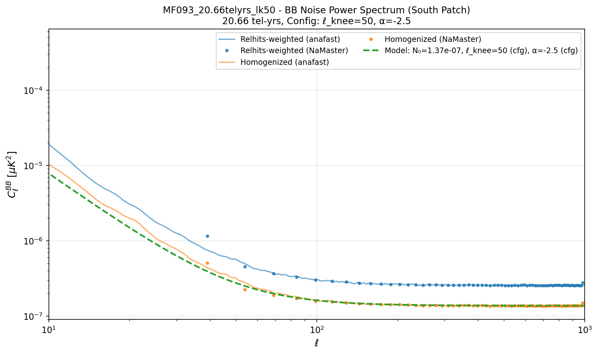 | 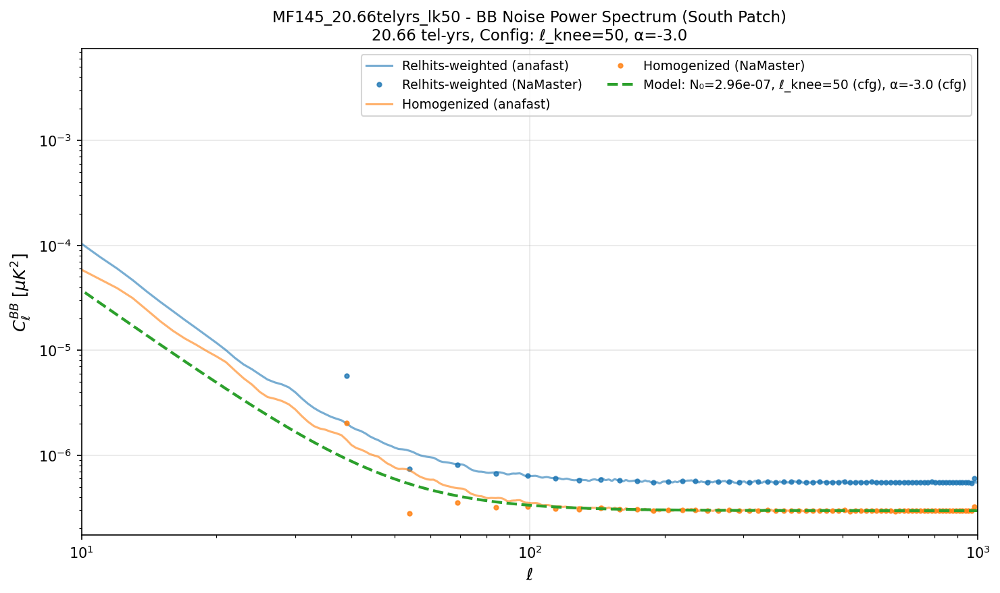 |

| HF 225 GHz | HF 280 GHz |
|------------|------------|
| 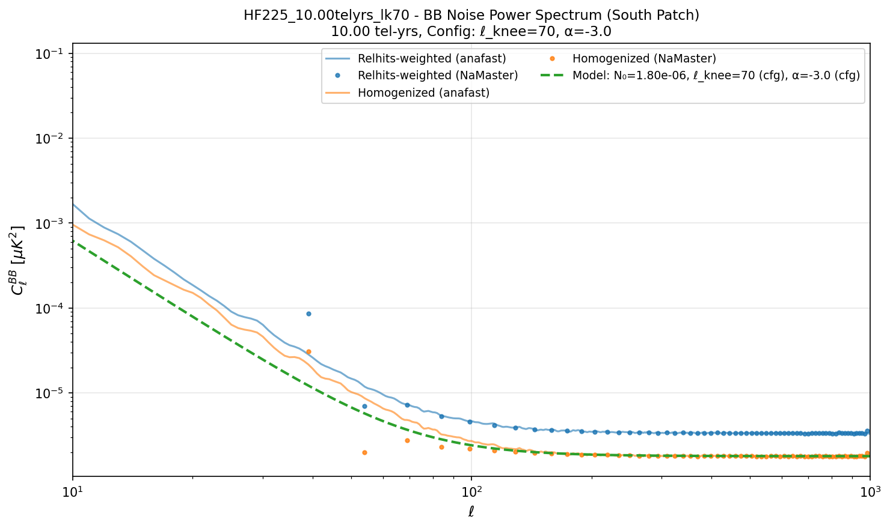 | 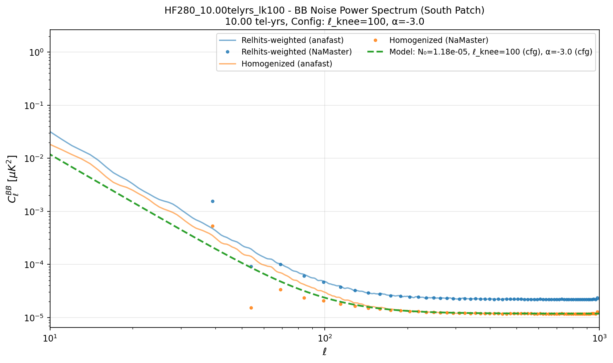 |

| HF 346 GHz (ℓ_knee=50) | HF 346 GHz (ℓ_knee=200) |
|------------------------|-------------------------|
| 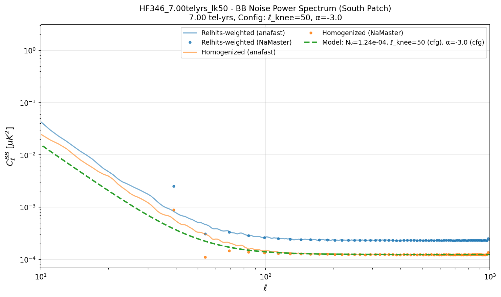 | 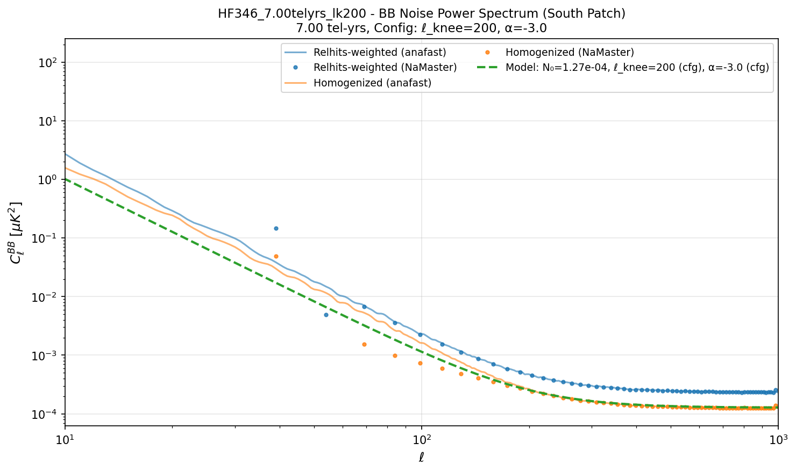 |

### 4.3 Fitted Noise Parameters

| Channel | N₀ (μK-arcmin) | ℓ_knee (cfg) | α (cfg) |
|---------|----------------|--------------|---------|
| LF027_2.00telyrs_lk30 | 25.27 | 30 | -2.4 |
| LF027_8.50telyrs_lk30 | 12.26 | 30 | -2.4 |
| LF039_2.00telyrs_lk30 | 15.65 | 30 | -2.4 |
| LF039_8.50telyrs_lk30 | 7.59 | 30 | -2.4 |
| MF093_20.66telyrs_lk50 | 1.27 | 50 | -2.5 |
| MF093_36.66telyrs_lk50 | 0.96 | 50 | -2.5 |
| MF145_20.66telyrs_lk50 | 1.87 | 50 | -3.0 |
| MF145_36.66telyrs_lk50 | 1.41 | 50 | -3.0 |
| HF225_10.00telyrs_lk70 | 4.61 | 70 | -3.0 |
| HF225_17.00telyrs_lk70 | 3.54 | 70 | -3.0 |
| HF280_10.00telyrs_lk100 | 11.82 | 100 | -3.0 |
| HF280_17.00telyrs_lk100 | 9.06 | 100 | -3.0 |
| HF346_7.00telyrs_lk50 | 38.30 | 50 | -3.0 |
| HF346_14.00telyrs_lk50 | 27.08 | 50 | -3.0 |
| HF346_7.00telyrs_lk200 | 38.76 | 200 | -3.0 |
| HF346_14.00telyrs_lk200 | 27.41 | 200 | -3.0 |

---

## 5. Ratio Tests

### 5.1 N₀ Ratio Test: Same tel_yrs, Different Frequencies

**Expected**: For channels with the same observation time, the ratio of N₀ values should equal the ratio of NET² values.

$$\frac{N_{0,1}}{N_{0,2}} = \left(\frac{\mathrm{NET}_1}{\mathrm{NET}_2}\right)^2$$

Reference NET values (μK√s): 27 GHz: 21, 39 GHz: 13, 93 GHz: 3.4, 145 GHz: 5.0, 225 GHz: 8.6, 280 GHz: 22, 346 GHz: 50

| Pair | tel_yrs | N₀ ratio (meas) | NET² ratio (exp) | Match? |
|------|---------|-----------------|------------------|--------|
| LF027_2.00telyrs / LF039_2.00telyrs | 2.00 | 2.6081 | 2.6095 | ✓ YES |
| LF027_8.50telyrs / LF039_8.50telyrs | 8.50 | 2.6081 | 2.6095 | ✓ YES |
| HF225_10.00telyrs / HF280_10.00telyrs | 10.00 | 0.1524 | 0.1528 | ✓ YES |
| HF225_17.00telyrs / HF280_17.00telyrs | 17.00 | 0.1524 | 0.1528 | ✓ YES |
| MF093_20.66telyrs / MF145_20.66telyrs | 20.66 | 0.4629 | 0.4624 | ✓ YES |
| MF093_36.66telyrs / MF145_36.66telyrs | 36.66 | 0.4629 | 0.4624 | ✓ YES |
| HF346_7.00telyrs_lk50 / HF346_7.00telyrs_lk200 | 7.00 | 0.9765 | 1.0000 | ✓ YES |
| HF346_14.00telyrs_lk50 / HF346_14.00telyrs_lk200 | 14.00 | 0.9765 | 1.0000 | ✓ YES |

### 5.2 N₀ Ratio Test: Same Frequency, Different tel_yrs

**Expected**: For channels at the same frequency but different observation times, N₀ should scale inversely with observation time.

$$\frac{N_{0,1}}{N_{0,2}} = \frac{t_{\mathrm{obs},2}}{t_{\mathrm{obs},1}}$$

| Pair | Freq (GHz) | N₀ ratio (meas) | tel_yrs ratio (exp) | Match? |
|------|------------|-----------------|---------------------|--------|
| LF027_2.00telyrs / LF027_8.50telyrs | 27 | 4.2500 | 4.2500 | ✓ YES |
| LF039_2.00telyrs / LF039_8.50telyrs | 39 | 4.2500 | 4.2500 | ✓ YES |
| MF093_20.66telyrs / MF093_36.66telyrs | 93 | 1.7744 | 1.7744 | ✓ YES |
| MF145_20.66telyrs / MF145_36.66telyrs | 145 | 1.7744 | 1.7744 | ✓ YES |
| HF225_10.00telyrs / HF225_17.00telyrs | 225 | 1.7000 | 1.7000 | ✓ YES |
| HF280_10.00telyrs / HF280_17.00telyrs | 280 | 1.7000 | 1.7000 | ✓ YES |
| HF346_7.00telyrs / HF346_14.00telyrs | 346 | 2.0000 | 2.0000 | ✓ YES |

---

## 6. Summary

All validation tests pass:

1. **Visual inspection**: Noise maps show expected spatial structure following the relative hits pattern
2. **Power spectra**: Measured BB spectra match the noise model with config ℓ_knee and α values
3. **N₀ scaling with NET²**: Channels with same observation time show correct frequency-dependent noise scaling
4. **N₀ scaling with observation time**: Same-frequency channels show expected 1/t_obs scaling

The variance map noise generation method correctly implements:
- Spatially-varying noise depth from observation strategy
- 1/f atmospheric noise component
- Proper scaling between temperature and polarization

---

## Files Reference

| File | Description |
|------|-------------|
| `code/generate_noise.py` | Core noise generation module |
| `code/run_generate_noise.py` | Batch generation script |
| `code/validate_noise_all_channels.py` | Validation and analysis script |
| `resources/instr_params_all_channels.yaml` | Channel specifications |
| `resources/variance_maps/` | Per-pixel variance maps |
| `output/all_channels/` | Generated noise realizations |
| `figures/all_channels_validation/` | Validation figures and results |
| `figures/all_channels_validation/fit_results.txt` | Tabulated fit results |
