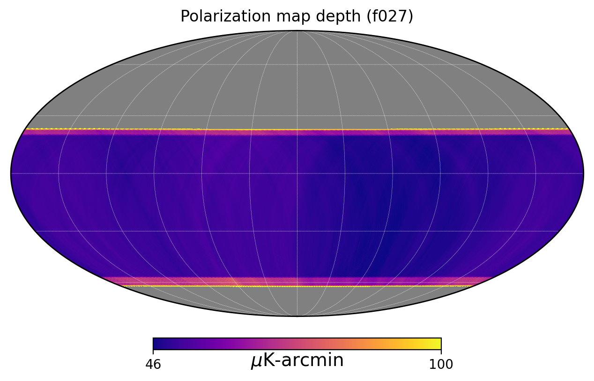
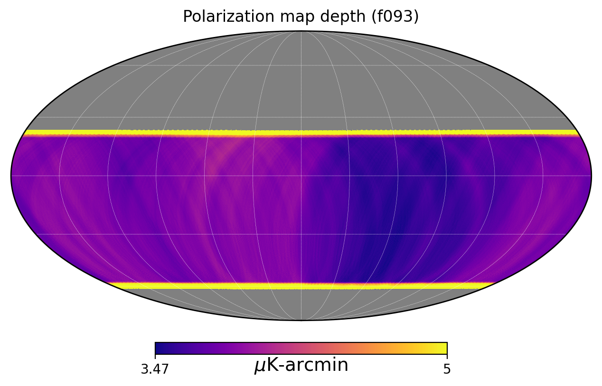
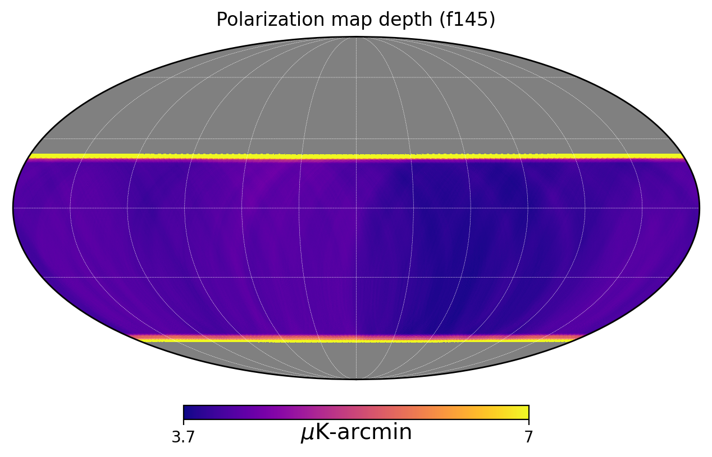

# SO LAT Polarization Noise Variance Maps

This document describes the methodology for creating polarized noise variance maps for the Simons Observatory (SO) Large Aperture Telescope (LAT).

## Overview

The noise variance maps are generated from telescope observation schedules, instrument NET (Noise Equivalent Temperature), and relative hits maps from simulated scan strategies. These maps provide spatially-varying noise estimates for polarization (Q/U) measurements.

## Input Data

### Relative Hits Maps
- **LF/MF bands**: `resources/so_lat_{band}_relhits_2048.fits` (band = lf, mf)
- **UHF bands**: `resources/so_lat_uhf_relhits_2048.fits`

The hits maps are at nside=2048.

### Instrument Parameters

Parameters are taken from `resources/instr_params_lat_channels.yaml`. 

**Note**: The knee frequency and alpha parameters differ for Intensity (I) and Polarization (P).

| Channel | Frequency (GHz) | Beam FWHM (arcmin) | ℓ_knee (I) | α (I) | ℓ_knee (P) | α (P) |
|---------|-----------------|--------------------|------------|-------|------------|-------|
| LF027   | 27              | 7.4                | 500        | -3.5  | 700        | -1.4  |
| LF039   | 39              | 5.1                | 500        | -3.5  | 700        | -1.4  |
| MF093   | 93              | 2.2                | 2100       | -3.5  | 700        | -1.4  |
| MF145   | 145             | 1.4                | 3000       | -3.5  | 700        | -1.4  |
| HF225   | 225             | 1.0                | 3800       | -3.5  | 700        | -1.4  |
| HF280   | 280             | 0.9                | 3800       | -3.5  | 700        | -1.4  |

### Detector Sensitivity

NET values used in the variance map generation:

| Frequency (GHz) | NET_telescope (μK√s) |
|-----------------|----------------------|
| 27              | 35                   |
| 39              | 18                   |
| 93              | 7.8                  |
| 145             | 8.4                  |
| 225             | 14.1                 |
| 280             | 35.4                 |

These values are assumed to have the detector yield factor folded in.  
### Efficiency Factors
- **Observation efficiency**: `obs_eff = 0.30` (Standard LAT efficiency factor)

---

## Telescope Observation Schedule

### Baseline Schedule (nominal SO + ASO from mid-2026)

Number of tubes deployed per year (2025-2035):

| Band  | '25  | '26  | '27  | '28  | '29  | '30  | '31  | '32  | '33  | '34  | '35  | **Total (tube-yrs)** |
|-------|------|------|------|------|------|------|------|------|------|------|------|----------------------|
| f030  | 0    | 1    | 1    | 1    | 1    | 1    | 1    | 1    | 1    | 1    | 1    | **10.0**             |
| f040  | 0    | 1    | 1    | 1    | 1    | 1    | 1    | 1    | 1    | 1    | 1    | **10.0**             |
| f090  | 4    | 8    | 8    | 8    | 8    | 8    | 8    | 8    | 8    | 8    | 8    | **84.0**             |
| f150  | 4    | 8    | 8    | 8    | 8    | 8    | 8    | 8    | 8    | 8    | 8    | **84.0**             |
| f220  | 2    | 4    | 4    | 4    | 4    | 4    | 4    | 4    | 4    | 4    | 4    | **42.0**             |
| f280  | 2    | 4    | 4    | 4    | 4    | 4    | 4    | 4    | 4    | 4    | 4    | **42.0**             |

---

## Noise Variance Calculation

### Formula

The polarization noise variance per pixel is calculated as:

$$\sigma^2_{\text{pix}} = \frac{(\sqrt{2} \cdot \text{NET})^2}{t_{\text{obs,pix}} \cdot \eta_{\text{obs}}}$$

Where:
- $\sqrt{2}$ factor converts from NET (temperature) to NEQ/U (polarization)
- $\text{NET}$ is the detector array noise equivalent temperature
- $t_{\text{obs,pix}}$ is the observation time per pixel in seconds
- $\eta_{\text{obs}}$ is the observation efficiency

### Observation Time per Pixel

$$t_{\text{obs,pix}} = \frac{t_{\text{total}} \cdot h_{\text{rel,pix}}}{\sum h_{\text{rel}}}$$

Where:
- $t_{\text{total}}$ is the total observation time (years $\times$ sec/year)
- $h_{\text{rel,pix}}$ is the relative hits at each pixel

---

## Output Variance Maps

### File Naming Convention
```
so_lat_{survey}_1_el_f{freq}_noise_var_{tel_yrs:.2f}tel-yrs.fits
```

### Surveys
- **wide**: The main wide-area survey.
- **delens-wide**: Delensing fields overlapping with the wide survey.
- **delens-bk**: Delensing fields overlapping with Bicep/Keck.

### Generated Files (Wide Survey examples)

| File | Description |
|------|-------------|
| `so_lat_wide_1_el_f027_noise_var_9.50tel-yrs.fits` | 27 GHz variance map |
| `so_lat_wide_1_el_f039_noise_var_9.50tel-yrs.fits` | 39 GHz variance map |
| `so_lat_wide_1_el_f093_noise_var_82.00tel-yrs.fits` | 93 GHz variance map |
| `so_lat_wide_1_el_f145_noise_var_82.00tel-yrs.fits` | 145 GHz variance map |
| `so_lat_wide_1_el_f225_noise_var_41.00tel-yrs.fits` | 225 GHz variance map |
| `so_lat_wide_1_el_f280_noise_var_41.00tel-yrs.fits` | 280 GHz variance map |

These maps encode the white noise level variations across the sky.

## Polarization Map Depth Summary

Estimated mapdepths in the deepest pixel:

| Channel | Map-depth ( $\mu$ K-arcmin) 
|---------|------------------------|
| f027    | 45                    |
| f039    | 23                     |
| f093    | 3.4                    |
| f145    | 3.7                    |
| f225    | 8.8                   |
| f280    | 22                   |

## Map Depth Visualizations

### 27 GHz


### 93 GHz


### 145 GHz


