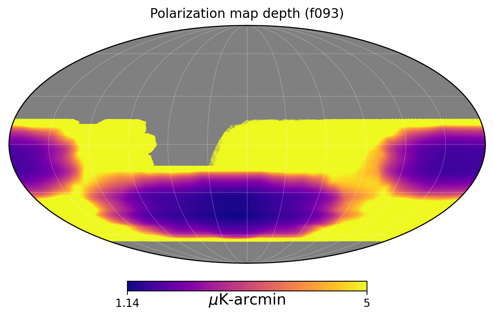
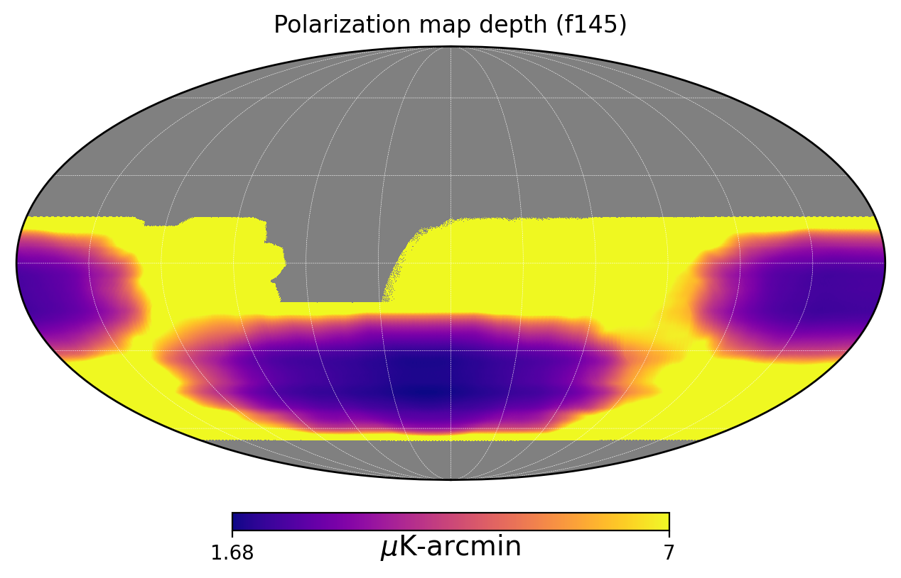
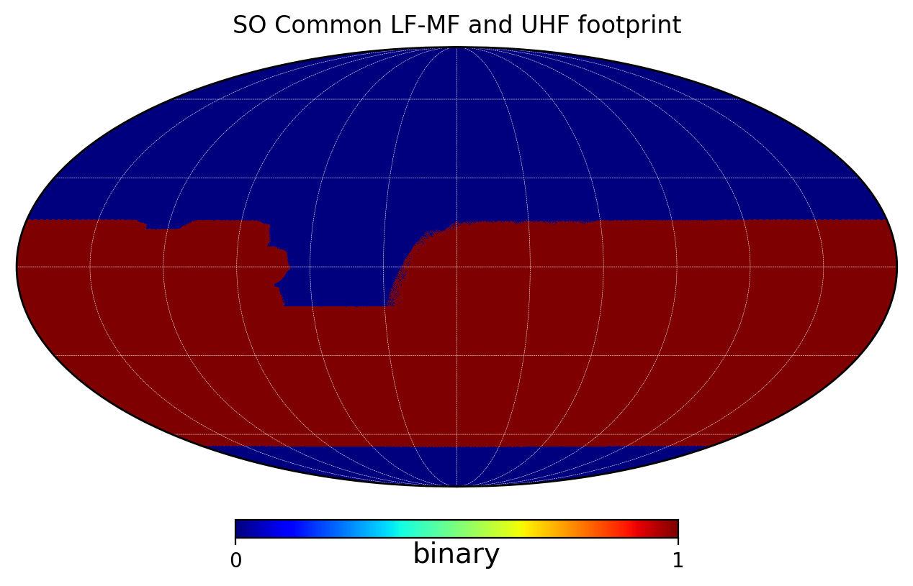
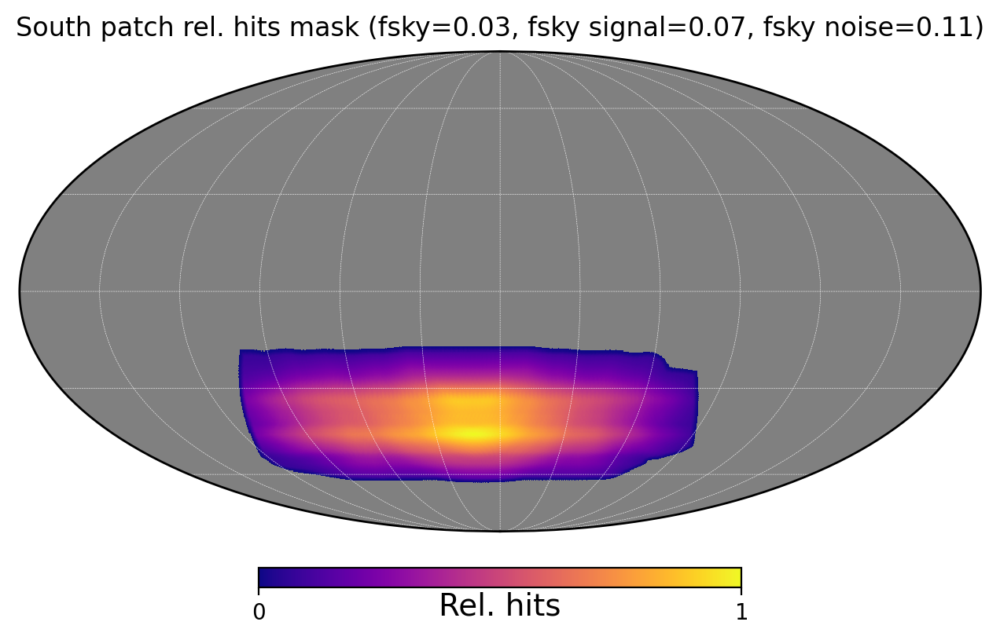
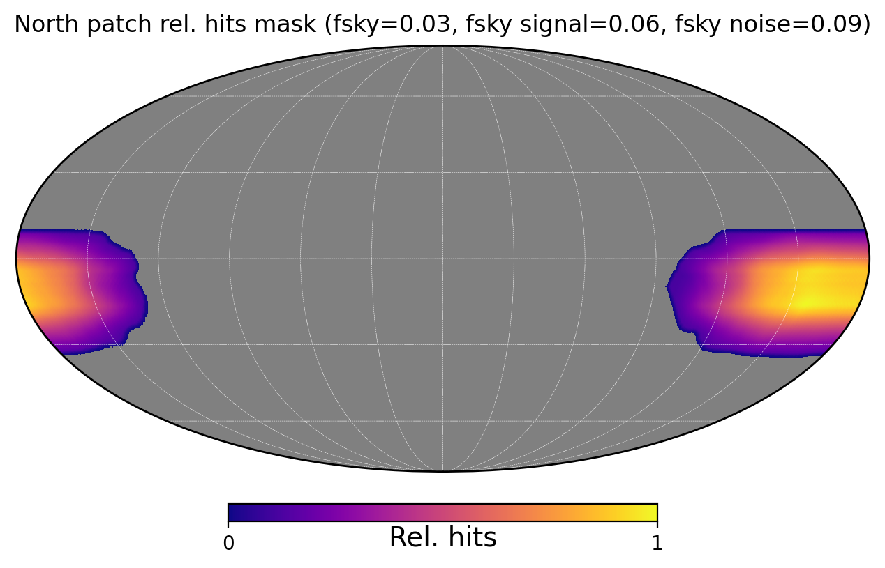

# SO SAT Polarization Noise Variance Maps

This document describes the methodology for creating polarized noise variance maps for the Simons Observatory (SO) Small Aperture Telescopes (SATs).

## Overview

The noise variance maps are generated from telescope observation schedules, instrument NET (Noise Equivalent Temperature), and relative hits maps from simulated scan strategies. These maps provide spatially-varying noise estimates for polarization (Q/U) measurements.

## Input Data

### Relative Hits Maps
- **LF/MF bands** (f027, f039, f093, f145): `/global/cfs/cdirs/sobs/sims/deso/unscaled/sat_wide/SAT_f090/sat_wide_SAT_f090_hits.fits`
- **UHF/EHF bands** (f225, f280, f346): `/global/cfs/cdirs/sobs/sims/deso/unscaled/sat_wide/SAT_f230/sat_wide_SAT_f230_hits.fits`

The hits maps are processed to nside=512 with 20 arcmin smoothing and normalized to relative hits.

### Instrument Parameters

| Frequency (GHz) | NET_telescope (μK√s) |
|-----------------|----------------------|
| 27              | 21                   |
| 39              | 13                   |
| 93              | 3.4                  |
| 145             | 5.0                  |
| 225             | 8.6                  |
| 280             | 22                   |
| 346             | 50                   |

### Efficiency Factors
- **Non-PWV observation efficiency**: `nonpwv_obs_eff = 0.33`
- **Detector yield**: `detector_yield = 0.7`

---

## Telescope Observation Schedules

### Baseline Schedule (with MF upgrade in Y4)

Number of tubes deployed per year (2025-2035):

| Band  | '25  | '26  | '27  | '28  | '29  | '30  | '31  | '32  | '33  | '34  | '35  | **Total (tube-yrs)** |
|-------|------|------|------|------|------|------|------|------|------|------|------|----------------------|
| f030  | 0    | 0    | 0.5  | 1    | 0.5  | 0    | 0    | 0    | 0    | 0    | 0    | **2.0**              |
| f040  | 0    | 0    | 0.5  | 1    | 0.5  | 0    | 0    | 0    | 0    | 0    | 0    | **2.0**              |
| f090  | 1.33 | 1.33 | 2    | 4    | 4    | 4    | 4    | 4    | 4    | 4    | 4    | **36.66**            |
| f150  | 1.33 | 1.33 | 2    | 4    | 4    | 4    | 4    | 4    | 4    | 4    | 4    | **36.66**            |
| f220  | 0    | 1    | 1    | 1    | 1    | 1    | 1    | 1    | 1    | 1    | 1    | **10.0**             |
| f280  | 0    | 1    | 1    | 1    | 1    | 1    | 1    | 1    | 1    | 1    | 1    | **10.0**             |
| f350  | 0    | 0    | 0    | 0    | 1    | 1    | 1    | 1    | 1    | 1    | 1    | **7.0**              |

### Alternative Schedules

#### 2MF Configuration (No MF upgrade)

| Band  | Total (tube-yrs) |
|-------|------------------|
| f030  | 2.0              |
| f040  | 2.0              |
| f090  | 20.66            |
| f150  | 20.66            |
| f220  | 10.0             |
| f280  | 10.0             |
| f350  | 7.0              |

#### 2UHF Configuration (Double UHF tubes from Y5)

| Band  | Total (tube-yrs) |
|-------|------------------|
| f030  | 2.0              |
| f040  | 2.0              |
| f090  | 36.66            |
| f150  | 36.66            |
| f220  | 17.0             |
| f280  | 17.0             |
| f350  | 14.0             |

#### Keep LF Configuration (LF tubes retained after Y4)

| Band  | Total (tube-yrs) |
|-------|------------------|
| f030  | 8.5              |
| f040  | 8.5              |
| f090  | 36.66            |
| f150  | 36.66            |
| f220  | 10.0             |
| f280  | 10.0             |
| f350  | 7.0              |

---

## Noise Variance Calculation

### Formula

The polarization noise variance per pixel is calculated as:

$$\sigma^2_{\text{pix}} = \frac{(\sqrt{2} \cdot \text{NET})^2}{t_{\text{obs,pix}} \cdot \eta_{\text{det}} \cdot \eta_{\text{obs}}}$$

Where:
- $\sqrt{2}$ factor converts from NET (temperature) to NEQ/U (polarization)
- $\text{NET}$ is the telescope noise equivalent temperature in μK√s
- $t_{\text{obs,pix}}$ is the observation time per pixel in seconds
- $\eta_{\text{det}} = 0.7$ is the detector yield
- $\eta_{\text{obs}} = 0.33$ is the non-PWV observation efficiency

### Observation Time per Pixel

$$t_{\text{obs,pix}} = \frac{t_{\text{total}} \cdot h_{\text{rel,pix}}}{\sum h_{\text{rel}}}$$

Where:
- $t_{\text{total}} = N_{\text{tube-yrs}} \times 365.25 \times 24 \times 3600$ seconds
- $h_{\text{rel,pix}}$ is the relative hits at each pixel

### Conversion to μK-arcmin

The variance map (in μK²/pixel) is converted to map depth (in μK-arcmin):

$$\sigma_{\text{μK-arcmin}} = 60 \times \sqrt{\sigma^2_{\text{pix}} \times \Omega_{\text{pix,deg}}}$$

Where $\Omega_{\text{pix,deg}}$ is the pixel solid angle in square degrees.

---

## Noise Levels Summary

### Deepest Pixel Noise (at relhits = 1.0)

| Frequency | Baseline (μK-arcmin) | 2MF (μK-arcmin) | 2UHF (μK-arcmin) | Keep LF (μK-arcmin) |
|-----------|----------------------|-----------------|------------------|---------------------|
| f027      | ~30                  | —               | —                | ~15                 |
| f039      | ~19                  | —               | —                | ~9                  |
| f093      | ~1.1                 | ~1.6            | —                | —                   |
| f145      | ~1.7                 | ~2.4            | —                | —                   |
| f225      | ~4.0                 | —               | ~3.1             | —                   |
| f280      | ~10                  | —               | ~8               | —                   |
| f346      | ~29                  | —               | ~20              | —                   |

*Note: Exact values depend on the hits map normalization and should be verified by running the notebook.*

---

## Output Variance Maps

### File Naming Convention
```
so_f{freq}_noise_var_{tube-yrs:.2f}tel-yrs.fits
```

### Generated Files

| File | Description |
|------|-------------|
| `so_f027_noise_var_2.00tel-yrs.fits` | LF 27 GHz baseline |
| `so_f027_noise_var_8.50tel-yrs.fits` | LF 27 GHz keep-LF |
| `so_f039_noise_var_2.00tel-yrs.fits` | LF 39 GHz baseline |
| `so_f039_noise_var_8.50tel-yrs.fits` | LF 39 GHz keep-LF |
| `so_f093_noise_var_36.66tel-yrs.fits` | MF 93 GHz baseline |
| `so_f093_noise_var_18.66tel-yrs.fits` | MF 93 GHz 2MF config |
| `so_f145_noise_var_36.66tel-yrs.fits` | MF 145 GHz baseline |
| `so_f145_noise_var_18.66tel-yrs.fits` | MF 145 GHz 2MF config |
| `so_f225_noise_var_10.00tel-yrs.fits` | UHF 225 GHz baseline |
| `so_f225_noise_var_17.00tel-yrs.fits` | UHF 225 GHz 2UHF config |
| `so_f280_noise_var_10.00tel-yrs.fits` | UHF 280 GHz baseline |
| `so_f346_noise_var_7.00tel-yrs.fits` | EHF 346 GHz baseline |
| `so_f346_noise_var_14.00tel-yrs.fits` | EHF 346 GHz 2EHF config |

All maps are at **nside=512** with column name `pol noise var pix` in units of `uK_CMB^2`.

---

## Map Depth Visualizations

### f093 (93 GHz) Polarization Map Depth


*Mollweide projection showing polarization map depth in μK-arcmin for the 93 GHz channel. Color scale: 1.14 - 5.0 μK-arcmin.*

### f145 (145 GHz) Polarization Map Depth


*Mollweide projection showing polarization map depth in μK-arcmin for the 145 GHz channel. Color scale: 1.68 - 7.0 μK-arcmin.*

### LF-MF vs UHF Footprint Coverage


*Comparison of LF-MF (f090 footprint) and UHF (f230 footprint) sky coverage. Regions with value=2 indicate overlap.*

---

## Analysis Patches

### South Patch Definition

The south patch is defined for delensing and power spectrum analysis:

**Selection criteria:**
1. Galactic latitude: $b < -10°$ (in Galactic coordinates)
2. Declination cut: $-65° < \delta < -15°$
3. Map depth cut: Remove pixels with depth > 4.5 μK-arcmin

**Apodization:** 2° C2 apodization applied using NaMaster

**Output files:**
- `so_south_patch_binary.fits` - Binary mask
- `so_south_patch_2dC2.fits` - Apodized mask
- `so_south_relhits_2dC2.fits` - Relative hits within apodized mask



### North Patch Definition

The north patch covers the equatorial region accessible from the Atacama site:

**Selection criteria:**
1. Galactic latitude: $b > 11°$ (in Galactic coordinates)
2. Declination cut: $-45° < \delta < 10°$
3. Map depth cut for 93 GHz: Remove pixels with depth > 4.5 μK-arcmin

**Apodization:** 2° C2 apodization applied using NaMaster

**Output files:**
- `so_north_patch_binary.fits` - Binary mask
- `so_north_patch_2dC2.fits` - Apodized mask
- `so_north_relhits_2dC2.fits` - Relative hits within apodized mask



### Sky Fractions

| Patch | f_sky (binary) | f_sky (signal) | f_sky (noise) |
|-------|----------------|----------------|---------------|
| South | 0.03           | 0.07           |  0.11         |
| North | 0.03           | 0.06           |  0.09         |

*Note: Exact values shown in notebook output. Signal and noise f_sky account for apodization weighting.*

---

## Additional Output Maps

### Relative Hits and Binary Masks

| File | Description |
|------|-------------|
| `so_lf_mf_relhits_512.fits` | Relative hits for LF/MF footprint |
| `so_uhf_relhits_512.fits` | Relative hits for UHF footprint |
| `so_lfmf_bin_512.fits` | Binary mask for LF/MF footprint |
| `so_uhf_bin_512.fits` | Binary mask for UHF footprint |
| `so_common_lf_mf_uhf_bin_512.fits` | Common footprint (overlap) |

---

## Code Reference

The variance maps are generated using the notebook:
```
code/var_maps_from_NET.ipynb
```

### Dependencies
- `numpy`
- `healpy`
- `matplotlib`
- `skytools` (for mask operations and resolution changes)
- `pymaster` (NaMaster, for mask apodization)

---

## Notes

1. The $\sqrt{2}$ factor in the variance formula accounts for the conversion from temperature sensitivity (NET) to polarization sensitivity (NEQ or NEU), as Q and U are measured with half the integration time compared to temperature.

2. The hits maps represent the relative observation time distribution across the sky from the SO SAT scan strategy simulations.

3. All variance maps assume uncorrelated white noise. Realistic noise will include $1/f$ contributions and correlations.

4. The efficiency factors (detector yield and observation efficiency) are conservative estimates that may be updated as the instrument is characterized.
